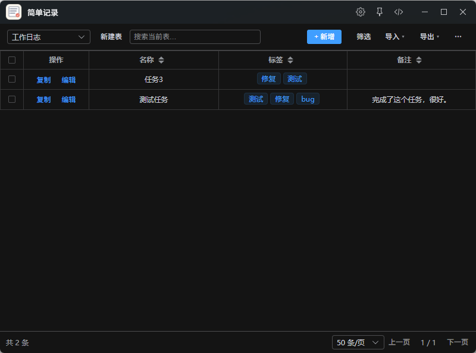

# 简单记录



> 自定义字段的简单记录表：用插件替代打开很慢的 Excel，快速录入工作记录，一键复制回 Excel。

## 更新日志

### v1.0.3 - 2026-09-30
- 修复：字段从文本改成单选/多选后，已有数据里的值不会出现在下拉框里。现在改类型时会询问「是否把已有取值收进选项」，也可在表设置的选项框下点「从已有数据收集」补收；所有单选/多选下拉都会显示表里已经出现过的值
- 修复：改字段类型后已有数据未按新类型转换（文本改多选/列表后单元格空白、改数字/日期残留旧字符串）
- 修复：「已回填 N 条记录」的条数显示（原来把表内总行数当成了回填条数）

### v1.0.2 - 2026-09-24
- 新增：行高样式开关，可在「固定行高（超出省略）」与「自适应行高（随内容撑高）」间切换
- 变更：「新建表」按钮移到工具栏左上角第一个位置
- 新增：高级筛选（AND 条件组），支持为空/不为空、包含、属于选项、今天/本周/本月
- 新增：筛选快捷按钮（本周创建 / 本月创建 / 今天更新 / 本周更新）
- 新增：字段默认值，新增记录自动预填；新增字段可选回填已有记录

## 这是什么？

**简单记录**是一款轻量结构化记事工具，适合代替「打开很慢的 Excel」来记工作事项、PM 单号、标签备注等。

你可以自己定义列（字段），比如：pm号、模块、标签、笔记链接……然后用表格快速增删改查，并一键复制回 Excel。

## 怎么用

| 指令 | 作用 |
|------|------|
| `记录` / `表格` / `简单记录` | 打开记录列表 |
| `记一笔` / `新增记录` | 弹窗快速记一条（记住上次选的表） |

### 日常记一条

1. 搜索「记一笔」打开弹窗  
2. 选表格、填写字段  
3. 点「保存」即可  

### 整理 / 交差

- 勾选多行 →「复制到 Excel」，到表格里 Ctrl+V  
- 「导出」→ CSV / TSV / JSON 备份  
- 「导入」→ 从 Excel 粘贴或 JSON 备份还原  

## 功能一览

- **多张表**：下拉切换；新建表后可自定义字段  
- **字段类型**：文本、长文本、列表、单选、多选/标签、链接、数字、日期、是否  
- **表设置**：改表名、字段、显示创建时间/修改时间；单选/多选可从已有数据一键收集选项  
- **查找**：搜索、高级筛选（为空/不为空、包含、选项、今天/本周/本月，可组合）、点列头排序  
- **字段默认值**：表设置里配置，新增记录自动预填；新增字段可回填已有记录  
- **选项自动收集**：字段改成单选/多选时自动把已有取值收进选项；下拉框始终包含表里出现过的值  
- **系统列**：创建时间、修改时间（只读，可排序、可导出）  
- **本地保存**：数据存在本机，不联网；请用 JSON 备份做迁移  

多值内容（如标签）展示时用顿号 `、` 连接；导入时也能识别 `、 ， , |`。

## 安装 / 开发

```bash
npm install
npm run dev    # 开发预览
npm run build  # 构建到 src-ztools/dist
```

## 技术说明

Vue 3 + TypeScript + Vite + Element Plus。数据使用 ZTools 本地存储（dbStorage + 双写回退）。

## 许可证

MIT
